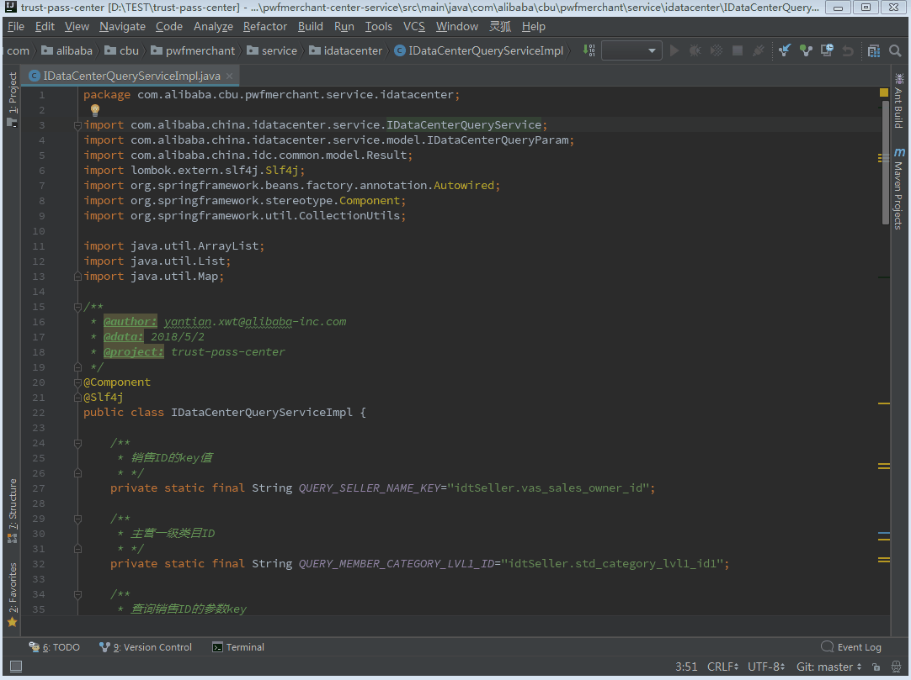
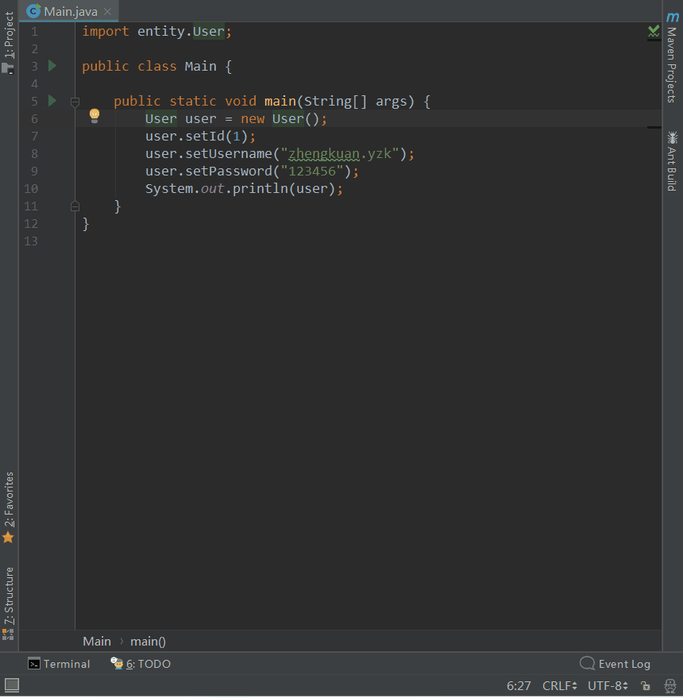

# IDEA自动转码插件 - 解决打开文件乱码的问题

## 1. 背景

在项目开发的过程中，通常需要查看依赖Jar包中的源码，但是现在的项目的编码通常采用UTF-8编码，而在之前的开发中大部分采用的是GBK编码，这样我们在查看源码时就会出现打开文件乱码的问题，如下图所示：

这种问题的通常解决方案是：

1. 点击文件编码菜单
2. 选择正确的文件编码（如果选择的和实际不一致，则需要再次尝试其他编码）
3. 点击Reload，重新载入文件，然后即可看到源码文件不再出现乱码

文件乱码问题非常普遍，而上述解决方案又过于繁琐，还不一定能够一次性选择正确的文件编码，给开发人员带来极大的不便，因此如何自动识别文件编码并进行转码是目前亟待解决的重要问题，能够提高开发人员的开发效率，保证写代码过程的顺畅丝滑**[手动滑稽]**。

    
    Before

## 2. 解决方案

二话不说，先看最终效果图【打开源码瞬间即可自动转码，解放手指，摆脱疲劳 **^_^**】：

具体解决方案如下：

开发IDEA插件，实现文件编码的正确识别以及转码动作的实时触发

1. 文件编码识别基于[cpdetector](http://cpdetector.sourceforge.net/)实现，可识别多种文件编码
2. 在IDEA中编辑器打开的所有文件均会对应一个VirtualFile【虚拟文件】，识别该对象的文件流的编码
3. 借鉴[IDEA Community](https://github.com/JetBrains/intellij-community)源码，自定义EncodingUtil，实现文件编码的设置
4. 实现监听器 FileChangedListener，监听IDEA编辑器中的文件切换事件【实现 FileEditorManagerListener】，在文件切换时，触发编码的识别及设置
5. 构建project的component，将上述监听器注册到项目的消息总线 project.messageBus 【实现 ProjectComponent】
6. 基于HashMap构建已识别的文件编码缓存，可有效提高插件的效率，不会重复执行文件流的编码识别过程

> 注：IDEA插件开发，有兴趣的同学可以参考[官网插件开发指导文档](https://link.jianshu.com/?t=http://www.jetbrains.org/intellij/sdk/docs/)

## 3. 项目地址

项目地址：https://github.com/YangZhengkuan/auto.transform.encoding

欢迎大家使用，感受顺畅丝滑般的体验！

如果有任何问题，请反馈给我 - **杨征宽(晚滨)** ，我会及时解答，并及时改进插件。

## 4. 安装方式

下载附件，或从[项目地址](https://github.com/YangZhengkuan/auto.transform.encoding)中下载auto.transform.encoding.zip，使用本地方式安装本插件，重启IDEA即可使用

> to be continue
> [idea plugins](https://plugins.jetbrains.com/)
